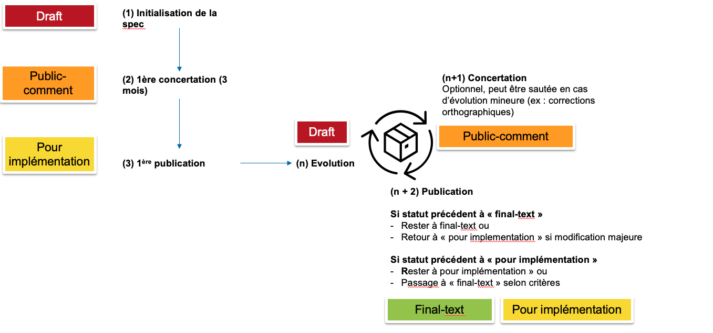

## Le cycle de vie et les statuts associés

Quatre statuts ont été identifiées pour les spécifications d'interopérabilité de l'ANS : "draft" ou "brouillon", "public-comment" ou "en concertation", "trial-implementation" ou "pour implementation", et "final-text" ou "final".

Ces statuts ont été inspirés des [pratiques d'IHE](https://wiki.ihe.net/index.php/Comments#Phases_of_Development) et adaptées pour les besoins de l'ANS. Il y a un label anglais pour correspondre aux statuts IHE ainsi que sa traduction française.
Les statuts "draft", "trial-implementation" et "final-text" reflètent la maturité des spécifications dans l'ordre indiqué.

### Le statut "draft" ou "brouillon"

Ce statut correspond à une spécification en cours de développement, il s'agit de son statut lors de la création de la spécification. Ce statut est particulièrement important pour les spécifications FHIR car tous les travaux sont publics et sont donc accessibles à tout moment de la création du répertoire GitHub à la publication.

### Le statut "public comment" ou "en concertation"

La spécification est publiée en première version pour concertation publique. La spécification n’est pas jugée suffisamment mature pour encourager son implémentation et nécessite la validation de l'écosystème pour être publiée et utilisée.
Une spécification en « final-text » ou en «  trial-implementation » peut repasser en commentaire public en cas d'évolution majeure.

### Le statut "trial-implementation" ou "pour implémentation"

La spécification est prête pour implémentation en situation réelle (projectathon, projet national …) pour être testée.
Ce statut est un reflet de la maturité : selon l'auteur, la spécification est prète pour une première implémentation.

### Le statut "final-text" ou "final"

La spécification est passée par au moins une implémentation en situation réelle. Elle a subi des corrections issues des retours post-développements (projectathon ou implementation nationale)
Les auteurs de la spécification ont estimé qu'elle avait atteint le stade de maturité le plus élevé. Ce stade est atteint lorsque la spécification est soit mise en œuvre au niveau national, soit testée lors d'un projectathon, et que la plupart des retours des implémenteurs ont été corrigés.
Ce statut est un reflet de la maturité : selon l'auteur, la spécification a déjà été éprouvée dans une ou plusieurs situations donnant un bon indice de confiance sur sa maturité.

### Les autres statuts

Une spécification peut également être "deprecated" ou "dépréciée" si celle-ci a été remplacée par une autre spécification ou "withdrawn" ou "retirée" après avoir été dépréciée depuis un moment.

### Le cycle de vie d'une spécification

Durant la vie d'une spécification, celle-ci peut passer par les différents statuts exprimés ci-dessus.

A noter, le statut de cycle de vie n'est pas associé à la version qui utilise le format semver, car une spécification peut toujours évoluer et changer de version (ex : passage à FHIR R6), et ceci est décorrélé du statut du cycle de vie. Lors de chaque nouvelle publication d'une spécification, le numéro de version va évoluer, et le statut du cycle de vie va évoluer en fonction du schéma ci-dessus.

Problématique : il peut y avoir plusieurs versions en final text.
Idéal : quand on publie une nouvelle version, les éditeurs ont un an pour la mettre en place. Au-delà, on n’accepte que la nouvelle version.
SDE – maturité est une information, il ne faut pas que ça fasse peur aux éditeurs

Il y a deux possibilités d'évolution une concertation de passer à « final-text ou bien à « for implementation » dépend du respect de critère de qualité avec le choix de l'auteur.
Pour passer en final-text, la spécification doit être passée par une implémentation nationale ou par des projectathons avec retours mineurs.
Une spec en Final-text peut repasser en « pour-implem » en cas de modification majeure

## Définition des critères de maturité

Lorem ipsum dolor sit amet, consectetur adipiscing elit, sed do eiusmod tempor incididunt ut labore et dolore magna aliqua. Ut enim ad minim veniam, quis nostrud exercitation ullamco laboris nisi ut aliquip ex ea commodo consequat. Duis aute irure dolor in reprehenderit in voluptate velit esse cillum dolore eu fugiat nulla pariatur. Excepteur sint occaecat cupidatat non proident, sunt in culpa qui officia deserunt mollit anim id est laborum

## Définition des critères de qualité

Lorem ipsum dolor sit amet, consectetur adipiscing elit, sed do eiusmod tempor incididunt ut labore et dolore magna aliqua. Ut enim ad minim veniam, quis nostrud exercitation ullamco laboris nisi ut aliquip ex ea commodo consequat. Duis aute irure dolor in reprehenderit in voluptate velit esse cillum dolore eu fugiat nulla pariatur. Excepteur sint occaecat cupidatat non proident, sunt in culpa qui officia deserunt mollit anim id est laborum

## Définition des métadonnées associées à une spécification d'interopérabilité

Les métadonnées correspondent aux données annexées aux spécifications. Elles sont utiles à des fins de recherche notamment.

| Nom | Description | Cardinalité | Exemples |
| --- | --- | --- | --- |
| identifiant | Identifiant ou URL identifiante d’accès à la spécification | 1..1 | https://interop.esante.gouv.fr/ig/fhir/pdsm |
| statut | Statut de la spécification selon les statuts définis par l’ANS. Les statuts peuvent être rédigés en anglais ou en français. | 1..1 | draft, public-comment, for-implementation, final-text |
| version | Version au format semver | 1..1 | 1.0.0 |
| code | Code qui définit la spécification | 1..1 | GAP, CR-BIO |
| titre | Titre de la spécification | 1..1 | Gestion d'Agendas Partagés |
| description | Description succinte du périmètre de la spécification | 1..1 | Ce guide d’implémentation a pour objet de permettre la gestion de ressources (personnes, lieux ou objets), la gestion des disponibilités de ces ressources, la consultation et la synchronisation d’agenda et la prise de rendez-vous. |
| date de dernière mise à jour | Date de dernière publication de la spécification | 1..1 | 2024-04-29 |
| Standards principaux | Standards syntaxiques et sémantiques, profils sur lesquels s'appuent la spécification | 0..* | CDA, FHIR, SNOMED CT |
| Contexte projet | Projet national ou référentiel notable où la spécification est utilisée | 0..1 | Mon Espace Santé |
| Catégorie | Catégorie métier de la spécification (équivalent des technical frameworks IHE) correspondant aux préfixes des spécifications CDA | 0..* | Imagerie, Biologie, Administratif, ... |
| Type | Type de spécification | 0..* | Document médical, définition d'APIs, outillage, couche métier, couche service, couche transport, documentation, ... |
| Utilisations connues | Formulaire d’auto-déclaration de conformité pour les éditeurs (à définir) | 0..* | à définir |
| Porteur | Permet d’afficher le porteur de laspécification. Particulièrement important dans le cas de l’UP externe | 1..1 | ANS, InteropSanté |
| Contact | Permet d’afficher le contact de la spécification. Particulièrement important dans le cas de l’UP externe | 1..1 | ci-sis@esante.gouv.fr |