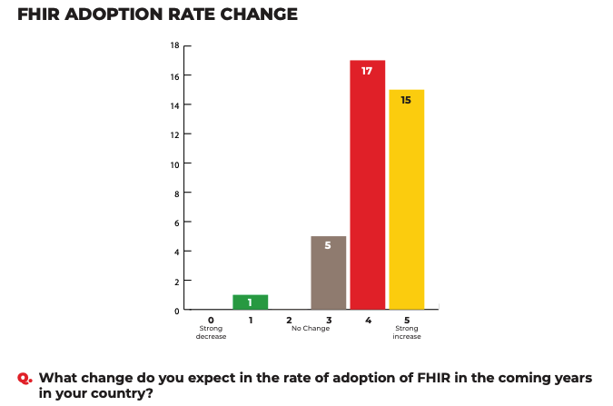
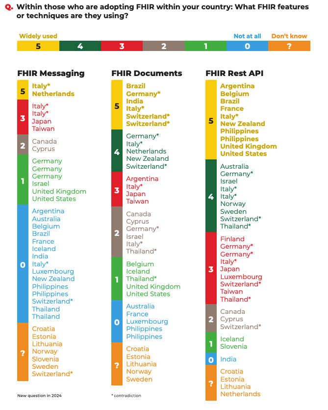

<!-- TOC generated with Auto Markdown TOC 
Nom : Auto Markdown TOC
ID : xavierguarch.auto-markdown-toc
Description : Markdown TOC (Table Of Contents) Plugin for Visual Studio Code.
Version : 2.1.4
Serveur de publication : Xavier Guarch
Lien de la Place de marché pour VS : https://marketplace.visualstudio.com/items?itemName=xavierguarch.auto-markdown-toc 
Transformé en HTML : https://markdowntohtml.com/ -->
<!-- TOC -->

    <ul>
        <li><a href="#quest-ce-que-linterop%C3%A9rabilit%C3%A9-">Qu&#39;est-ce que l&#39;interopérabilité ?</a></li>
        <li><a href="#strat%C3%A9gie-des-versions-fhir">Stratégie des versions FHIR</a>
            <ul>
                <li><a href="#nouveaux-cas-dusages-fhir-adress%C3%A9s-par-interopsant%C3%A9-et-lans--privil%C3%A9gier-fhir-r4-et-anticiper-la-transition-vers-r6">Nouveaux cas d’usages FHIR adressés par Interop’Santé et l’ANS : privilégier FHIR R4 et anticiper la transition vers R6</a></li>
                <li><a href="#ne-pas-cr%C3%A9er-dig-se-basant-sur-r5-sans-cas-dusage-identifi%C3%A9">Ne pas créer d’IG se basant sur R5 sans cas d’usage identifié</a></li>
                <li><a href="#priorit%C3%A9-fhir-france-en-2024-et-2025---am%C3%A9liorer-la-qualit%C3%A9-de-lexistant">Priorité FHIR France en 2024 et 2025 - Améliorer la qualité de l’existant</a></li>
            </ul>
        </li>
        <li><a href="#listing-des-acteurs-influen%C3%A7ant-la-trajectoire">Listing des acteurs influençant la trajectoire</a>
            <ul>
                <li><a href="#les-acteurs-dits-politiques">Les acteurs dits &quot;politiques&quot;</a></li>
                <li><a href="#les-acteurs-dits-techniques">Les acteurs dits &quot;techniques&quot;</a></li>
                <li><a href="#les-acteurs-dits-impl%C3%A9menteurs">Les acteurs dits &quot;implémenteurs&quot;</a></li>
            </ul>
        </li>
        <li><a href="#focus-fhir-document">Focus FHIR Document</a>
            <ul>
                <li><a href="#etude-internationale">Etude internationale</a></li>
                <li><a href="#int%C3%A9r%C3%AAt-dusage-du-fhir-document">Intérêt d&#39;usage du FHIR document</a></li>
                <li><a href="#position-de-lagence-du-numerique-en-sant%C3%A9">Position de l&#39;Agence du Numerique en Santé</a><ul>
                <li><a href="#mettre-en-place-une-transformation-entre-les-standards-cda-et-fhir">Mettre en place une transformation entre les standards CDA et FHIR</a></li>
                <li><a href="#permettre-une-utilisation-concommitante-de-fhir-et-de-cda-le-temps-dune-transition-vers-fhir">Permettre une utilisation concommitante de FHIR et de CDA le temps d&#39;une transition vers FHIR</a></li>
            </ul>
        </li>
        </ul>
        </li>
        <li><a href="#actions-men%C3%A9es-pour-encourager-linterop%C3%A9rabilit%C3%A9">Actions menées pour encourager l&#39;interopérabilité</a></li>
        <li><a href="#le-paradigme-document-du-dmp-%C3%A0-compl%C3%A9ter-par-un-service-orient%C3%A9-donn%C3%A9e">Le paradigme &quot;Document&quot; du DMP à compléter par un service orienté donnée</a></li>
    </ul>

## Qu'est-ce que l'interopérabilité ?

L'interopérabilité est la capacité de deux systèmes informatiques à communiquer ensemble. L'intérêt stratégique pour la e-santé est immense pour le patient et pour la recherche clinique grâce un partage et un accès facilité à la donnée, intégrable, réutilisable, exploitables.

Pour faciliter l'accès et le partage de la donnée de santé, il est nécessaire de construire un langage de données informatique uniforme de manière collaborative en s'appuyant sur des standards internationaux, avec l'ensemble des acteurs de l'écosystème. Fédérer un maximum d'acteurs autour de l'interopérabilité est primordial pour répondre à un besoin donné car cela permet d'obtenir la vision la plus large possible (métier, technique, politique) et d'être accepté et utilisé par tous.
Le rôle de l'expert interopérabilité est central pour fédérer en comprenant les problématiques de chacun (ex. le besoin fonctionnel du métier), et pour mettre au service sa veille informationnelle afin d'utiliser le standard d'interopérabilité le plus approprié au cas d'usage.

Pour les développeurs, l'interopérabilité doit être pensé au plus tôt au moment de la conception du logiciel, et être "interoperable by design", car une fois des interfaces graphiques développées totalement corrélées aux flux propriétaires, il est bien plus coûteux de faire l'évolution dans l'autre sens.

L'interopérabilité est souvent confondue avec référencement, or ils ne sont pas synonymes. Les référencements peuvent avoir des exigences d'interopérabilité, c'est à dire la nécessité de respecter certains modèles de données, mais les exigences peuvent être beaucoup plus larges : sécurité, hébergement HDS, ...

--> L'interopérabilité ne concerne pas que les entreprises qui veulent se faire référencer

## Stratégie - choix de la version FHIR

La stratégie sur le choix des versions FHIR a été définie au sein d'un groupe de travail organisé entre InteropSanté et l'ANS en 2023/2024, complétée par une [concertation](https://participez.esante.gouv.fr/project/fhir-r5-ou-r4/presentation/presentation) de l'ANS. Les conclusions de ce GT sont indiquées ci-dessous.

### Nouveaux cas d’usages FHIR adressés par Interop’Santé et l’ANS : privilégier FHIR R4 et anticiper la transition vers R6

Pour garantir un écosystème cohérent et permettre l'interopérabilité, il est nécessaire d'utiliser une même version du standard FHIR à l'échelle nationale. Il a ainsi été choisi de conserver FHIR R4 car il y a un existant conséquent en France et cela permet d'éviter une double transition R4 --> R5 et R5 --> R6. Ce choix est conforté car la release 6 se veut être la “final stable version” de FHIR, une transition vers R6 se voudra de toute manière nécessaire. Pour anticiper cette transition, il est jugé important d’être proactif sur les travaux internationaux de R6 et d’anticiper les impacts pour l’écosystème français.

### Ne pas créer d’IG se basant sur R5 sans analyse des normes et standards et des impacts

La priorité actuelle est de faire monter l’écosystème en compétences et de gagner en maturité sur les spécifications existantes. Créer des IGs R5 engendreraient une fragmentation de l’écosystème et un ralentissement de la mise en qualité de l’existant qui finirait par freiner l’adoption de FHIR.

Dans certains cas, une autre version de FHIR peut être justifiée, par exemple si le cas d'usage concerne des échanges internationaux ou pour que le cas d'usage est mieux répondu dans une autre version. Le cas échéant, l’usage d’une autre version devra être validé par une étude des normes et standards et par l’écosystème.

Si un cas d’usage où FHIR R5 a été justifié, et que celui-ci nécessite des profils nationaux (FrCore) :

    <ul>
        <li> Créer un profil FrCore dans l’IG du cas d’usage en mimant ce qui a été fait en R4 (comme dans cet IG autrichien) </li>
        <li> Si le besoin de profils est répété au niveau de plusieurs cas d’usages, créer un IG FrCore R5 à alimenter progressivement avec de nouveaux profils. </li>
    </ul>

Dans certains cas non identifiés à ce jour, il pourrait également être nécessaire de maintenir des guides d’implémentation sous plusieurs versions. Après validation par l’écosystème de ce besoin, cela donnerait l’opportunité d'estimer des travaux de maintenance d’Implementation Guide (IG) sous plusieurs versions ainsi qu’un mapping associé pour gagner en expérience.

### Priorité FHIR France en 2024 et 2025 - améliorer la qualité de l’existant

De nombreux travaux ont été menés en 2023 pour mettre en qualité les spécifications FHIR et encourager leur déploiement, tel que le passage au format IG et la mise à jour des tests et validateurs gazelle.

Les priorités des prochaines années sont de continuer dans cette direction :

    <ul>
        <li>La montée en compétences et l’acculturation des développeurs aux bonnes pratiques d’usages de FHIR, notamment en organisant des évènements par l'ANS et InteropSanté : projectathon, webinaires, formations, ...</li>
        <li>S’assurer de la faisabilité d’implémentation des IGs existants (amélioration du contenu narratif pour expliquer comment utiliser les ressources, s’assurer de la facilité d’accès au contenu, …).</li>
        <li>La prise en main des outils de mapping tel que le FHIR Mapping Language afin d'assurer une transition maîtrisée vers une autre version de FHIR.</li>
        <li>Anticiper les prochaines évolutions internationales : passage au FHIR Document dans le cadre du règlement européen, anticiper la transition vers FHIR R6, ...</li>
    </ul>

Il est également nécessaire de rester à l’écoute des tendances internationales en interopérabilité et de se garder la possibilité de réitérer l’analyse si le besoin ou le contexte international évolue.

<!-- ## Cartographie de l'interopérabilité -->

## Listing des acteurs influençant la trajectoire

Il est important de noter que de nombreux acteurs influencent la trajectoire et que le rôle des experts interopérabilité est d'avoir cette vision globale pour répondre aux besoins en réutilisant au maximum les travaux existants au niveau internationale.

Les acteurs peuvent se classifier sur plusieurs statuts : au niveau politique, au niveau technique et au niveau implémentation.

### Les acteurs dits "politiques"

Ministère de la santé, commission européenne, EHDS

### Les acteurs dits "techniques"

IHE, HL7 International, HL7 Europe

### Les acteurs dits "implémenteurs"

La CNAM (DMP, Mon Espace Santé), l'écosystème français des éditeurs de logiciels de soin

## Focus FHIR Document

Aujourd'hui en France, l'ensemble des documents médicaux sont stockés en CDA, notamment avec la plus grande plateforme technique médicale nationale : le DMP, brique de Mon Espace Santé. Le nouveau standard d'interopérabilité FHIR, connu pour son API Rest standard, est utilisé dans de nombreux cas d'usages en France : l'annuaire santé, le ROR, le SAS, Mon Espace Santé, .... L'usage de FHIR peut être étendu aux documents.

### Etude internationale

Selon l'étude [2024 State of FHIR](../../assets/docs/2024 StateofFHIRSurveyResults_final.pdf), l'utilisation du standard FHIR augmente dans la majorité des pays.

Cette même étude dévoile un nombre important de pays utilisant le FHIR document.

De plus, les projets européens European Health Data Space (EHDS) ayant fait une étude de normes et standards pour les échanges transfrontaliers au sein de l'Europe a conclu sur l'usage du FHIR Document. Ce choix est justifié par le fait que certains pays n'ont pas d'historiques et choisissent très logiquement d'utiliser le standard FHIR étant plus récent et plus à la mode.
FHIR a été choisi comme standard largement préféré pour les trois cas d'usages identifiés par l'Europe comme partage transfrontalier : le lab report, l'hospital discharge report et enfin le medical imaging report (resp. 18, 17 et 16 membres préféraient FHIR contre 3, 5 et 5 pour CDA).

### Intérêt d'usage du FHIR document

En plus de la trajectoire internationale semblant mener vers l'usage du FHIR document, des avantages non négligeables sont à noter sur l'usage de ce nouveau standard.

    <ul>
        <li>Les FHIR Document sont composés d'une multitude de brique, appelée ressource (ex : Observation, Patient, Encounter, ...) qui peuvent être extraites du document facilement pour être consommées et réutilisées au sein d'une API Rest par exemple.</li>
        <li>Les spécifications peuvent être publiées en open source sur GitHub car leur édition est totalement en mode texte (FSH / markdown), permettant ainsi de faciliter la collaboration, la remontée d'erreurs, la participation de l'écosystème, l'automatisation des différences entre les versions et du changelog, l'historisation automatique des anciennes versions, ...</li>
        <li>Les développements faits seront facilement réutilisables à l'international (ex : Lab Report d'HL7 Europe dévié pour la France), ce qui facilite l'internationalisation des entreprises.</li>
    </ul>

Aux Etats-Unis, les spécifications CDA ont fait leur premier pas vers FHIR, celles-ci sont publiées sont forme de guide d'implémentation en modèle logique, permettant ainsi de valider les CDA avec le FHIR Validator en abandonnant les schematrons [source](https://build.fhir.org/ig/HL7/CDA-ccda/validation.html#:~:text=Validation%20Note-,What%20happened%20to%20the%20Schematron%3F,of%20the%20C%2DCDA%20document.)

### Position de l'Agence du Numerique en Santé

La nécessité de prioriser la prise en charge du FHIR document est à ce point indéniable, de nombreux indices sur les études internationales et la multiplication de projets lancés mettent en lumière le consensus international sur l'utilisation du FHIR Document.

Il existe deux possibilités quant à l'usage du standard FHIR dans la gestion des documents en France

#### Mettre en place une transformation entre les standards CDA et FHIR

Ces travaux ont un défaut : la nécessité de maintenir le mapping entre les standards avec les nouvelles versions des spécifications CDA et FHIR qui vont sortir, avec un grand niveau de difficulté. Par exemple, des [travaux italiens sur ce sujet](https://build.fhir.org/ig/hl7-it/cda2fhir/index.html) contiennent plusieurs dizaines de miliers de lignes. Il y a également des questionnements quant à la responsabilité : qui serait responsable d'une erreur de transformation ?

Pour une transformation des CDA vers FHIR complète, il faudrait que l'ensemble des spécifications CDA françaises soient définies au format StructureDefinition pour utiliser le FHIR Mapping Language.

#### Permettre une utilisation concommitante de FHIR et de CDA le temps d'une transition vers FHIR

Cette solution permettrait une utilisation concommitante de FHIR et de CDA, où les spécifications seront publiées selon les deux modes. Cela permettrait une transition douce avec un timing au choix de chacun vers le passage au paradigme FHIR Document.

Ainsi, au même titre que les documents CDA ne sont pas automatiquement transformés vers les nouvelles versions des spécifications, les documents historiques resteront au format CDA et les nouveaux au format FHIR Document.

La solution qui semble se dessiner pour l'ANS est de permettre une utilisation concommitante de FHIR et de CDA pour faire une transition douce, complétée d'une preuve de concept d'un mapping CDA - FHIR, générique, sans aller jusqu'à une spécification validée et utilisable en production, pour aider les éditeurs dans leur transition.

## Actions menées pour encourager l'interopérabilité

Gazelle, SMT, GitHub, PAT

## Le paradigme "Document" du DMP à compléter par un service orienté donnée

L'historique français avec le DMP montre le cas d'usage "document" : un document est un compte rendu médical signé et daté d'un patient. Il est possible de voir un nouveau cas d'usage qui n'est pas orienté document mais plutôt "donnée unitaire" où une API Rest peut être davantage adatée.

Il y a par exemple déjà actuellement les API Mesures de santé et Agenda de mon espace santé où il y a des données accessibles via des requêtes REST sans document médical.

Ainsi, il ne faudra pas négliger ce paradigme API REST de données unitaires pour certains cas d'usages s'y pretant bien, comme par exemple une API de vaccination, une API Cercle de Soins, une API pour la diffusion des essais cliniques ouverts au recrutement. L'intérêt tout particulier de ce type d'API réside sur l'utilisation de critères de recherches standards définis par FHIR pour accéder à l'information d'intérêt simplement, sans superflux.

